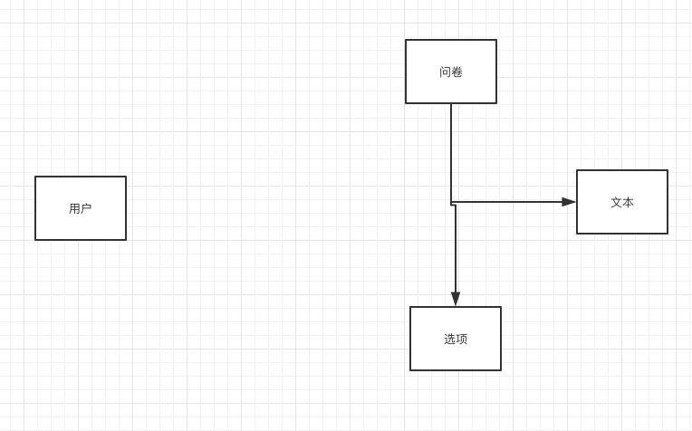
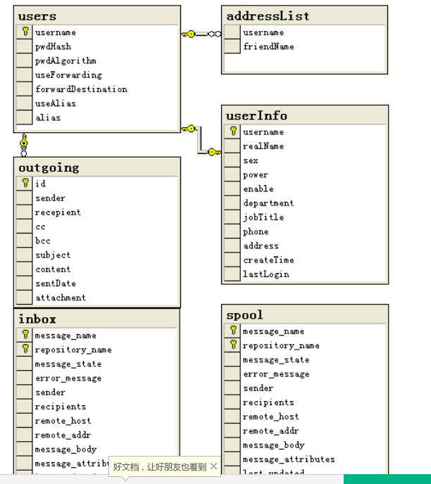
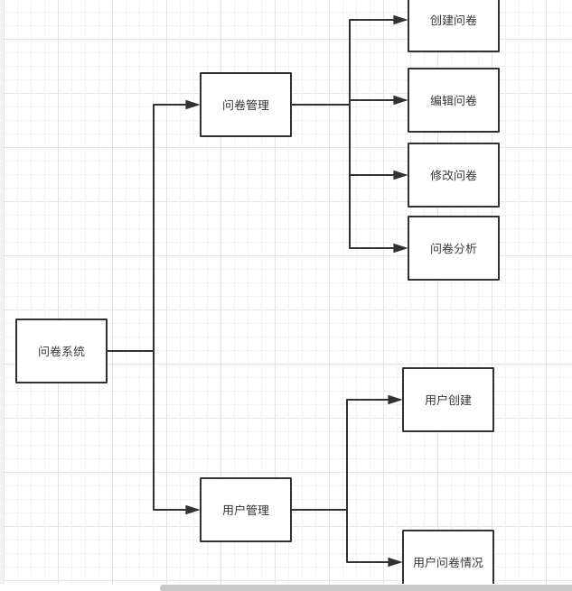
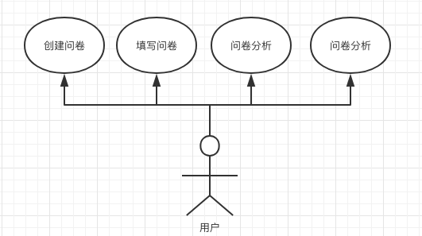
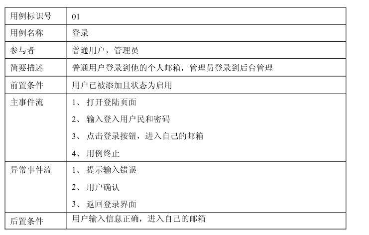
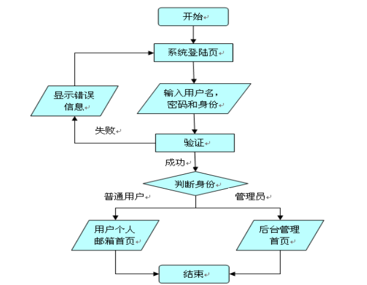
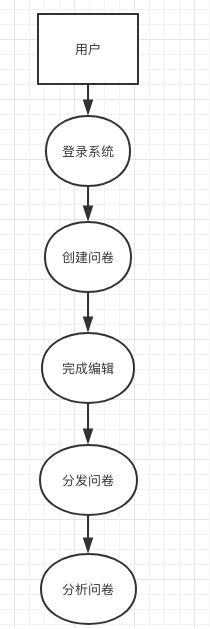
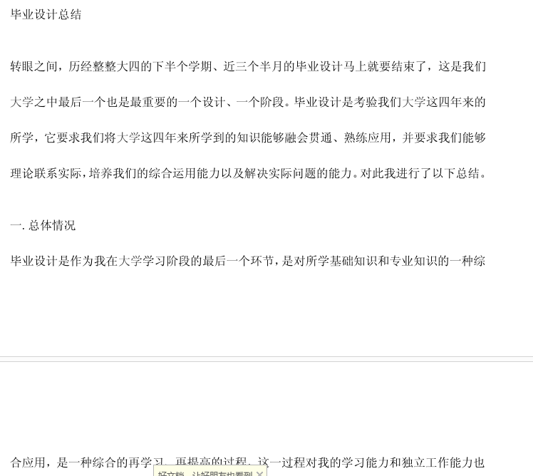
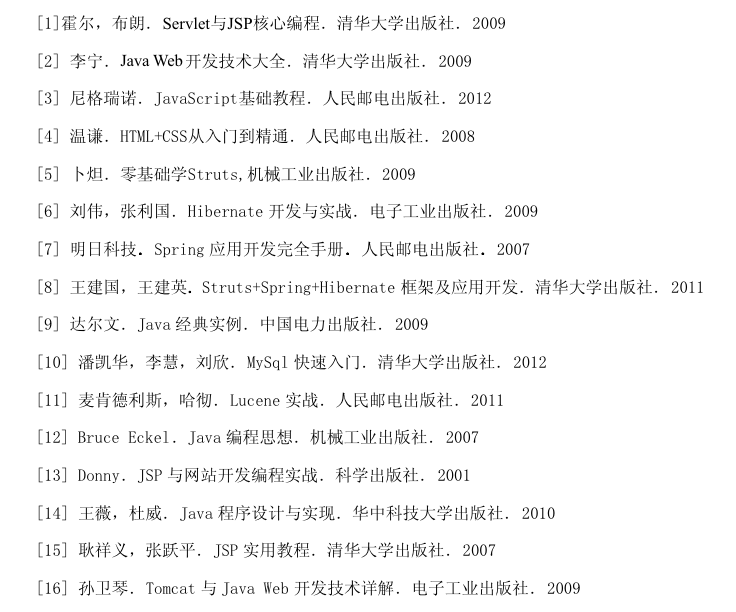

#基于web端的问卷调查系统

##基于web端的问卷调查系统 — Model（模型层）View（视觉层）Control（控制层）

- 【摘要】

  现代社会中，办公等工作越来越电子化，纸质物品逐渐离开大众的视野，电子化办公才是当前的主旨。问卷的形式，最开始为使用纸质印刷问卷，进行人工的分发，之后收回问卷，再一步步的进行数据的分析和统计，整个过程耗时耗力，且调查范围极其有限。到了互联网时代，通过网络进行调查有诸多好处。例如对于问卷的创建、发放、回收、分析的过程都可以节约大量时间。当然除了时间上的节省，对于问卷而言的另一个核心要素，用户的样本广度与深度也能有大幅度的提升。这对于传统的问卷行业是一个颠覆性的创造。与此同时，各类集体也需要一个统一的平台进行调查以及整理意见，以此推动整体项目的前进，改进团队的优劣处。因此大批量的web端问卷调查系统涌现了出来，但是对于市面上大部分的问卷系统而言，除了原有问卷系统的创建、分析等基础功能外，并没有一家系统对团体进行整体的规划，对于特定团队进行调查的情况还不能很方便的进行。因此本次设计就是基于此种状况，设计的问卷调查系统。除了主流市场上应有的问卷基础功能：创建问卷、问卷修改、问卷分析，团队问卷的管理是此次研究系统的主要功能点。

  整体而言，使用JSP作为主要技术导向。使用MVC框架进行构建，既模型层（Model）程序特定域信息的表现形式、视图层（View）模型的表现形式，通过输入元素和按钮等用户界面元素，通过这些模型与元素进行交互、控制器（Control）负责解释用户的输入并转换为模型，然后将转换后的结果显示给用户。三层清晰的结构划分，每个角色都能够单独的使用一个类进行控制。在层次方面显而易见，对于很多业务代码，可进行重复的使用。对于很多本地化标签库有很好的支持，类似JSTL这样的标签库能够很好的适配使用。还有一大优点是对于配置的直接性，框架层和应用程序类都能作为JavaBean来配置，在web控制器中也能对业务对象和验证器进行引用。对于开发而言是极其便利的事情。

- 【关键词】

便利 问卷调查 设计模式

- [Abstract]

  Nowadays, office is going to electric, the paper work had far away people, the porpulation work is electric. The questionnaire is also envole from divide use paper, now throught internet. The whole process is waste a lot of time. Also the range is very less. Enter international time, we can get a lots of goods thing from survier from internet. For example, question create, divide, replace, analyse… Every comment need a plant to search and recogornize option, use to push entity problem, and advenge advantage and disadvantage. Therefore many questionnaire system base on web had be discovered. But many of them hadn't divild for team. Based on this constitution, I desigh this questionnarire system.

  Every comment need a plant to search and recogornize option, use to push entity problem, and advenge advantage and disadvantage. Therefore many questionnaire system base on web had be discovered. But many of them hadn't divild for team. Based on this constitution, I desigh this questionnarire system.

  Every comment need a plant to search and recogornize option, use to push entity problem, and advenge advantage and disadvantage. Therefore many questionnaire system base on web had be discovered. But many of them hadn't divild for team. Based on this constitution, I desigh this questionnarire system.

  Every comment need a plant to search and recogornize option, use to push entity problem, and advenge advantage and disadvantage. Therefore many questionnaire system base on web had be discovered. But many of them hadn't divild for team. Based on this constitution, I desigh this questionnarire system.

  Every comment need a plant to search and recogornize option, use to push entity problem, and advenge advantage and disadvantage. Therefore many questionnaire system base on web had be discovered. But many of them hadn't divild for team. Based on this constitution, I desigh this questionnarire system.

  All of all, used JSP language. And MVC + JavaBean to devepment this system.

- [Keywords]
  convenient, questionnaire, common framework

[TOC]

## 第一章 绪论

#### 1.1 问卷系统背景

问答，是对目标对象的意见调查的一个方法，问卷系统则是由一系列的小问题组成，然后去访问，收集被调查者的意见、感受、反应等等。通过问卷，可以在短时间内采集到很多人的反应，通过对这些反应的收集分析，在日后进行类比、统计之后能够得到对现有情况，大众的整体反应。当然这样的方法也存在一定的缺点，例如无法百分百保证收集到的内容是准确的事实。通常情况下，涉及到个人的隐私情况时，往往不能得到满意的结果。

在以往，想要进行问卷调查的唯一途径是通过将问卷印刷出来，再丢每个人进行分发。仅仅是这一步，所消耗的人力物力都是非常巨大的。而且有很大的缺点，就是样本的范围性。能够收集到的数据是人们创造出问卷，再找到愿意填写的人。这一部分的数据，然而，对于问卷系统，样本若是过小，则不具备代表性。且，对于地域的局限性也是非常巨大的问题。除了分发这一步，在用户填写完成之后，哪怕问卷一份不差的回收了，对于数据的处理，亦是原问卷系统的一大问题。样本数量较小时能较为完善的统计，当问卷的数量上升到百份、千份之后，处理数据所需要的人力和时间也是很严重的问题。这对于传统问卷是致命伤，但是在互联网时代有了新的解决方案。

随着互联网的发展，越来越多的用户通过在Web上发布调查问卷。相较于纸质的问卷系统，互联网的问卷系统有几大显著的提升。对于人力物力的节省，创建问卷和分发的过程不再像以前需要打印出来在进行一个人一个人的发送。这样的突破能带来效率的巨大提升，特别对于问卷数据的分析，选择题的情况能够通过计算机在极其短暂的时间内计算出结果。而不需要人们再慢慢将每份问卷的结果统计，这样的突破可谓是颠覆性的。在以前需要耗时一两天的工程，如今只需要几分钟。样本的广度与深度，通过网络的传播，问卷能够到达四面八方，天南海北的用户都能参与进来进行填写。这样的样本范围，是以前不可能实现的，并且传播的成本近乎为零，所需要做的事情仅仅是定位目标用户，对他们进行一定的宣传就够了。这两点的提升，让传统的问卷方法黯然失色。

目前市面上主流的问卷系统为：腾讯问卷、问卷网、问卷星、麦克CRM、调查派、番茄表单、金数据。

主流的问卷调查系统拥有的功能为：登录注册、问卷创建、问卷管理、数据分析、分享问卷、有偿填写问卷。

对于现有的问卷调查系统而言，所共有的功能为基础的问卷模块以及数据分析部分。这是问卷调查系统的核心，此次研发的系统也会对其进行开发。对于用户方面的问题，除了基础的登录注册外，还提供部分信息的修改。且对于市面上的问卷系统缺失的一个功能进行重点的研发，用户分组的管理。

#### 1.2 课题意义

电子化办公已是现在的主流趋势，但是对于问卷调查系统而言，除了大面积扩散进行数据收集以外，对于特定人群进行问卷调查也是一个刚需，其实这也是问卷系统的原本意义所在，对于特定人群进行数据采集，因为样本的广度并能作为问卷数据好坏唯一指标，即数据量大的问卷可能问题也很大。原因在于某些特定问题，例如：对于新发布的某种规则有什么建议？这样的问题并不适用于进行广度的调研。毕竟很多人与此类问题没有任何关联，对于这部分用户取样的数据是没有任何意义的，这种情况即数据量够大，但是结果却不一定准确。甚至因为数据量过于杂乱，导致此问卷只能作废。如何对于特定的人群进行调研，是现在主流的问卷调查系统都没有进行研究的一个方向。例如：特定班级/年级的学生、公司内部特定部门等进行问卷调查，因此，此次选题的主要研究方向即是：如何能够对特定人群进行数据采集。

主要思想为，对于管理层的用户。这类用户，可以进行批量创建账号。这样做的好处是，可以很方便的进行团队的管理，而且一个团队仅仅需要管理层进行团队的管理。管理者可以对于团队内的人完成问卷的总体情况有一个了解。但是考虑到一个问题，如若实名制会导致问卷的真实性大幅度下降，所以不推荐进行实名制的问卷调查。除了部分问卷涉及到官方性或者触及到政治问题时，这类问卷需要严肃对待时再进行实名调查才好。

对于团队内的成员而言，成员在登录自己的账号之后，能够在自己的问卷中心内看到自己需要填写的问卷。这在很大程度上免去了用户需要多做的操作。

#### 1.3 研究内容

此次研发的系统主要功能是：登录注册、个人信息修改、问卷创建、问卷管理、数据分析、用户分组信息管理。

第一章：主要阐述问卷系统的背景和来源，以及这次开发的系统的实际意义与现实意义。简单介绍了问卷实现的原理，以及论述了论文主要的工作。

第二章：问卷系统的可行性分析，重点在于软件开发时使用工具已经在什么环境下进行的开发。包括安卓的行业概述，操作系统的架构和应用程序的分析、常见的数据库以及数据管理的要求。

第三章：系统设计。对系统的功能进行概要分析，同时展示系统逻辑和物理两方面的内容，再介绍了系统包含的各个功能进行详细的介绍。

第四章：系统实现，从客户端与服务端两个方面介绍，主要对各个模块例如问卷创建，问卷修改，问卷分析进行详细的介绍，以及功能和系统关键代码的呈现。

第五章：系统测试，描述了系统的测试用例以及系统的各个部分的完成情况。

第六章：总结与展望，主要介绍了项目完成的经验，存在的不足以及缺陷，最后是对于未来的一些展望。

#### 1.4 设计思想

基于web端设计，以JSP核心设计。使用JavaBean + MVC架构进行编写。通过M（model）V（view）C（control）三层来实现系统的功能。意义在于，用户的输入与输出均为JSP页面，本系统采用MVC的设计模式，用户输入输出界面均为JSP页面，即展示层（VIEW），用户的请求（REQUEST）将会被发送到控制层（CONTROL）的一个SERVLET集中处理，根据请求调用模型层（MODEL）的JAVABEAN对请求进行实际处理，并把结果返回给控制层，控制层根据请求的执行结果将响应（RESPONSE）派发到相应的JSP页面。 

## 第二章 问卷系统可行性分析

需求分析是软件分析中的一个重要步骤。它的基本任务是要准确地分析出系统应用者的需要，以及系统目标必须具备哪些功能。这些功能必须准确地，完整地体现出用户的要求。

#### 2.1 行业概述

目前市场上主要的几大问卷系统是：

腾讯问卷，腾讯问卷不管是界面还是功能，无疑是国内所有调查问卷平台最好用最全面的。它是一个免费、专业的问卷调查系统。提供多种方式创建问卷，简单高效的编辑方式，强大的逻辑设置功能，专业的数据统计和样本甄别，让您轻松开启调研工作。

麦客CRM，是一款在线表单制作工具，同时也是强大的客户信息处理和关系管理系统。她可以帮助你轻松完成信息收集与整理，实现客户挖掘与消息推送，并开展持续营销。

问卷星，免费创建问卷调查、在线考试、360度评估等应用；问卷星提供30多种题型，强大的统计分析功能，统计报告和原始答卷可免费下载；完美支持手机填写，微信群发。

调查派，是一个简单、好用的免费自助调查工具。可以帮助用户快速制作自己的在线问卷，通过网页、微博、微信等渠道发布，并自动统计数据，生成报表。支持问题间逻辑定义，添加自定义LOGO等功能。

问卷网，拥有创新的编辑界面和结果分析界面,海量的问卷和表单模板,支持十余种常见题型和多种问卷发布渠道.专注于为企业和个人提供问卷表单的创建,发布,管理,收集及分析服务。

番茄表单，是一款免费好用的表单设计和数据收集分析工具，它能够帮你快速创建各种在线表单问卷，适配在线报名、满意度调查、产品反馈、信息登记、预约订购、行政财务等各种需要收集信息的场景，还可嵌入至微信公众号、企业网站等多种渠道，后台生成的报表让数据分析更简单。免费版每月可提交1000条数据。

金数据，可提供问卷调查、客户登记、意见反馈、活动报名、在线订单等。金数据自动收集并整理数据，帮助用户节省工作时间，更聪明、更体面的完成工作。但是，免费版每月只能提交50条数据。

各个问卷系统都有自己独特的功能，但是用户最多的还是问卷星与腾讯问卷两者。可以看出互联网时代，大家对于问卷系统的需求还是很大的。

#### 2.2 开发的工具和环境

#####2.2.1 关键技术

一、Java

使用java与数据库结合。由于java可在各个平台都能运行，可以用来开发多数应用程序。作为面向对象的编程语言，很多方面都接近于人类的思想。随着Internet网络的迅速发展，基于互联网的企业应用要求软件平台具有开放性、分布性和平台无关性。于是就相继出现了RPC/COM/CORBA等技术，但这些技术在实际应用中存在着许多不足和局限。它们的特定协议难以通过防火墙，因而不适于Web上的应用开发。为了进一步开发基于Web的应用，出现了Sun公司的Sun ONE（Open Net Environment 开发网络环境）和Microsoft公司的.NET等Web 服务技术体系。   Sun ONE体系结构以Java语言为核心，包括J2SE/J2EE/J2ME和一系列的标准、技术及协议。它包括Sun独有的iPlanet软件系列，其中有在市场上受欢迎的LDAP目录服务器软件，以及Forte for Java——便于在任何环境下书写Java 语言的软件工具。我们很容易就能从网上免费获得和使用包括Java 集成开发环境、Java数据库和中间件（Application Server）服务器等产品，以及它们的源代码。Sun ONE更接近或能满足互联网在智能化Web服务方面对分布性、开发性和平台无关性的要求。   随着Java技术的不断发展，它根据市场进一步细分为:针对企业网应用的J2EE（Java 2 Enterprise Edition）、针对普通PC应用的J2SE（Java 2 Standard Edition）和针对嵌入式设备及消费类电器的J2ME（Java 2 Micro Edition）三个版本。

J2EE为搭建具有可伸缩性、灵活性、易维护性的商务系统提供了良好的机制，它具有以下突出的优点：

1、事实的标准：J2EE是由SUN引导，各厂商共同发起的，并得到广泛认可的工业标准，业内的大企业（如IBM，BEA，ORACLE等）都积极参与，很多应用软件开发商也把自己的产品转移到J2EE平台上来，使之成为事实的工业标准。因此，J2EE拥有良好的市场和旺盛的生命力。

2、可保存现有的IT资产：使用J2EE能够充分利用客户原有的投资，保留已有的信息资源；同时，由于基于J2EE平台的产品几乎在任何操作系统和硬件配置上都可以运行，现有的操作系统和硬件也能够被保留使用。

3、高效的开发：J2EE允许公司把一些通用的、很繁琐的服务端任务交给中间件供应商去完成。这样开发人员可以集中精力在如何创建业务逻辑上，相应地缩短了开发时间。

4、支持异构环境：J2EE能够开发部署在异构环境中的可移植程序。基于J2EE的程序不依赖于任何特定操作系统、中间件、硬件。因此设计合理的基于J2EE的应用程序只需开发一次就可被部署到各种平台。这在典型的异构企业计算环境中是十分重要的。J2EE标准也允许客户定购与J2EE兼容的第三方的现成的组件，把它们部署到异构环境中，节省了由自己制定整个方案所需的费用。

5、可伸缩性：企业必须选择一种服务器端平台，这种平台应能提供极佳的可伸缩性去满足那些在它们的系统上进行商业运作的大批新客户。基于J2EE平台的应用程序可被部署到各种操作系统上。例如可被部署到高端UNIX和大型机系统，这种系统单机可支持64至256个处理器。（这是NT服务器所望尘莫及的）J2EE领域的供应商提供了更为广泛的负载平衡策略，能消除系统中的瓶颈，允许多台服务器集成部署。这种部署可达数千个处理器，实现可高度伸缩的系统，满足未来商业应用的需要。

6、稳定的可用性：一个服务器端平台必须能够全天候运转以满足公司客户和合作伙伴的需要。因为Internet是全球化的、无处不在的，即使在夜间按计划停机也可能造成严重损失。意外停机有可能造成灾难性后果。可以把J2EE部署到可靠的操作环境中,它们支持长期的可用性。最健壮的操作系统可达到99.999％的可用性或每年只需5分钟的停机时间，这是实时性很强商业系统理想的选择。

二、html、css、JavaScript

html，万维网上的一个超媒体文档称之为一个页面（外语：page）。作为一个组织或者个人在万维网上放置开始点的页面称为主页（外语：Homepage）或首页，主页中通常包括有指向其他相关页面或其他节点的指针（超级链接），所谓超级链接，就是一种统一资源定位器（Uniform Resource Locator，外语缩写：URL）指针，通过激活（点击）它，可使浏览器方便地获取新的网页。这也是HTML获得广泛应用的最重要的原因之一。在逻辑上将视为一个整体的一系列页面的有机集合称为网站（Website或Site）。超级文本标记语言（英文缩写：HTML）是为“网页创建和其它可在网页浏览器中看到的信息”设计的一种标记语言。
网页的本质就是超级文本标记语言，通过结合使用其他的Web技术（如：脚本语言、公共网关接口、组件等），可以创造出功能强大的网页。因而，超级文本标记语言是万维网（Web）编程的基础，也就是说万维网是建立在超文本基础之上的。超级文本标记语言之所以称为超文本标记语言，是因为文本中包含了所谓“超级链接”点。

超级文本标记语言是标准通用标记语言下的一个应用，也是一种规范，一种标准，它通过标记符号来标记要显示的网页中的各个部分。网页文件本身是一种文本文件，通过在文本文件中添加标记符，可以告诉浏览器如何显示其中的内容（如：文字如何处理，画面如何安排，图片如何显示等）。浏览器按顺序阅读网页文件，然后根据标记符解释和显示其标记的内容，对书写出错的标记将不指出其错误，且不停止其解释执行过程，编制者只能通过显示效果来分析出错原因和出错部位。但需要注意的是，对于不同的浏览器，对同一标记符可能会有不完全相同的解释，因而可能会有不同的显示效果。

css，CSS是一种定义样式结构如字体、颜色、位置等的语言，被用于描述网页上的信息格式化和现实的方式。CSS样式可以直接存储于HTML网页或者单独的样式单文件。无论哪一种方式，样式单包含将样式应用到指定类型的元素的规则。外部使用时，样式单规则被放置在一个带有文件扩展名_css的外部样式单文档中。
样式规则是可应用于网页中元素，如文本段落或链接的格式化指令。样式规则由一个或多个样式属性及其值组成。内部样式单直接放在网页中，外部样式单保存在独立的文档中，网页通过一个特殊标签链接外部样式单。
名称CSS中的“层叠（cascading）”表示样式单规则应用于HTML文档元素的方式。具体地说，CSS样式单中的样式形成一个层次结构，更具体的样式覆盖通用样式。样式规则的优先级由CSS根据这个层次结构决定，从而实现级联效果。

JavaScript，JavaScript一种直译式脚本语言，是一种动态类型、弱类型、基于原型的语言，内置支持类型。它的解释器被称为JavaScript引擎，为浏览器的一部分，广泛用于客户端的脚本语言，最早是在HTML（标准通用标记语言下的一个应用）网页上使用，用来给HTML网页增加动态功能。

三、jQuery

jQuery是一个快速、简洁的JavaScript框架，是继Prototype之后又一个优秀的JavaScript代码库（或JavaScript框架）。jQuery设计的宗旨是“write Less，Do More”，即倡导写更少的代码，做更多的事情。它封装JavaScript常用的功能代码，提供一种简便的JavaScript设计模式，优化HTML文档操作、事件处理、动画设计和Ajax交互。

jQuery的核心特性可以总结为：具有独特的链式语法和短小清晰的多功能接口；具有高效灵活的css选择器，并且可对CSS选择器进行扩展；拥有便捷的插件扩展机制和丰富的插件。

四、SQL

结构化查询语言(Structured Query Language)简称SQL，是一种特殊目的的编程语言，是一种数据库查询和程序设计语言，用于存取数据以及查询、更新和管理关系数据库系统；同时也是数据库脚本文件的扩展名。
结构化查询语言是高级的非过程化编程语言，允许用户在高层数据结构上工作。它不要求用户指定对数据的存放方法，也不需要用户了解具体的数据存放方式，所以具有完全不同底层结构的不同数据库系统, 可以使用相同的结构化查询语言作为数据输入与管理的接口。结构化查询语言语句可以嵌套，这使它具有极大的灵活性和强大的功能。

五、Spring

Spring是一个开放源代码的设计层面框架，他解决的是业务逻辑层和其他各层的松耦合问题，因此它将面向接口的编程思想贯穿整个系统应用。Spring是于2003 年兴起的一个轻量级的Java 开发框架，由Rod Johnson创建。简单来说，Spring是一个分层的JavaSE/EE full-stack(一站式) 轻量级开源框架。

轻量——从大小与开销两方面而言Spring都是轻量的。完整的Spring框架可以在一个大小只有1MB多的JAR文件里发布。并且Spring所需的处理开销也是微不足道的。此外，Spring是非侵入式的：典型地，Spring应用中的对象不依赖于Spring的特定类。
控制反转——Spring通过一种称作控制反转（IoC）的技术促进了低耦合。当应用了IoC，一个对象依赖的其它对象会通过被动的方式传递进来，而不是这个对象自己创建或者查找依赖对象。你可以认为IoC与JNDI相反——不是对象从容器中查找依赖，而是容器在对象初始化时不等对象请求就主动将依赖传递给它。
面向切面——Spring提供了面向切面编程的丰富支持，允许通过分离应用的业务逻辑与系统级服务（例如审计（auditing）和事务（transaction）管理）进行内聚性的开发。应用对象只实现它们应该做的——完成业务逻辑——仅此而已。它们并不负责（甚至是意识）其它的系统级关注点，例如日志或事务支持。
容器——Spring包含并管理应用对象的配置和生命周期，在这个意义上它是一种容器，你可以配置你的每个bean如何被创建——基于一个可配置原型（prototype），你的bean可以创建一个单独的实例或者每次需要时都生成一个新的实例——以及它们是如何相互关联的。然而，Spring不应该被混同于传统的重量级的EJB容器，它们经常是庞大与笨重的，难以使用。
框架——Spring可以将简单的组件配置、组合成为复杂的应用。在Spring中，应用对象被声明式地组合，典型地是在一个XML文件里。Spring也提供了很多基础功能（事务管理、持久化框架集成等等），将应用逻辑的开发留给了你。
MVC——Spring的作用是整合，但不仅仅限于整合，Spring 框架可以被看做是一个企业解决方案级别的框架。客户端发送请求，服务器控制器（由DispatcherServlet实现的)完成请求的转发，控制器调用一个用于映射的类HandlerMapping，该类用于将请求映射到对应的处理器来处理请求。HandlerMapping 将请求映射到对应的处理器Controller（相当于Action）在Spring 当中如果写一些处理器组件，一般实现Controller 接口，在Controller 中就可以调用一些Service 或DAO 来进行数据操作 ModelAndView 用于存放从DAO 中取出的数据，还可以存放响应视图的一些数据。 如果想将处理结果返回给用户，那么在Spring 框架中还提供一个视图组件ViewResolver，该组件根据Controller 返回的标示，找到对应的视图，将响应response 返回给用户。
所有Spring的这些特征使你能够编写更干净、更可管理、并且更易于测试的代码。它们也为Spring中的各种模块提供了基础支持。

七、XML

XML即可扩展标记语言（eXtensible Markup Language）。标记是指计算机所能理解的信息符号，通过此种标记，计算机之间可以处理包含各种信息的文章等。如何定义这些标记，既可以选择国际通用的标记语言，比如HTML，也可以使用象XML这样由相关人士自由决定的标记语言，这就是语言的可扩展性。XML是从SGML中简化修改出来的。它主要用到的有XML、XSL和XPath等。 

八、JDBC

有了JDBC，向各种关系数据发送SQL语句就是一件很容易的事。换言之，有了JDBC API，就不必为访问Sybase数据库专门写一个程序，为访问Oracle数据库又专门写一个程序，或为访问Informix数据库又编写另一个程序等等，程序员只需用JDBC API写一个程序就够了，它可向相应数据库发送SQL调用。同时，将Java语言和JDBC结合起来使程序员不必为不同的平台编写不同的应用程序，只须写一遍程序就可以让它在任何平台上运行，这也是Java语言“编写一次，处处运行”的优势。
Java数据库连接体系结构是用于Java应用程序连接数据库的标准方法。JDBC对Java程序员而言是API，对实现与数据库连接的服务提供商而言是接口模型。作为API，JDBC为程序开发提供标准的接口，并为数据库厂商及第三方中间件厂商实现与数据库的连接提供了标准方法。JDBC使用已有的SQL标准并支持与其它数据库连接标准，如ODBC之间的桥接。JDBC实现了所有这些面向标准的目标并且具有简单、严格类型定义且高性能实现的接口。
Java 具有坚固、安全、易于使用、易于理解和可从网络上自动下载等特性，是编写数据库应用程序的杰出语言。所需要的只是 Java应用程序与各种不同数据库之间进行对话的方法。而 JDBC 正是作为此种用途的机制。
JDBC 扩展了 Java 的功能。例如，用 Java 和 JDBC API 可以发布含有 applet 的网页，而该 applet 使用的信息可能来自远程数据库。企业也可以用 JDBC 通过 Intranet 将所有职员连到一个或多个内部数据库中（即使这些职员所用的计算机有 Windows、 Macintosh 和UNIX 等各种不同的操作系统）。随着越来越多的程序员开始使用Java 编程语言，对从 Java 中便捷地访问数据库的要求也在日益增加。
MIS管理员们都喜欢 Java 和 JDBC 的结合，因为它使信息传播变得容易和经济。企业可继续使用它们安装好的数据库，并能便捷地存取信息，即使这些信息是储存在不同数据库管理系统上。新程序的开发期很短。安装和版本控制将大为简化。程序员可只编写一遍应用程序或只更新一次，然后将它放到服务器上，随后任何人就都可得到最新版本的应用程序。对于商务上的销售信息服务， Java 和JDBC 可为外部客户提供获取信息更新的更好方法。

##### 2.2.2 技术路线

对于工具的选择，Eclipse是很好的一个平台，但是IDEA也有很多值得使用的地方。对于各类的加持，我认为IDEA更适用于此项目的开发。所以我选择了IDEA作为我的开发工具。

JDK可以说是必备的东西，没有JDK无法进行Java的开发。在按照JDK之后，进行各端的配置。Tomcat是服务器的设置，用来作为服务端的。

最开始编程时，我将所有的代码都写在了JSP文件内部，这样写出来的代码文件很少，但是整理起来很难，需要修改功能时也很难定位到具体位置。这样的代码在我编写到后面，对自己造成了很大的困扰。在之后的编程过程中，我将各个部分的代码都进行了独立，功能方面，样式方面以及网页内响应的功能各个分开，之后再进行功能的修改则是很容易的事情。也因此提高了代码的整体可读性，不再像之前那样杂乱无章，容易引起误会或是找不到具体的功能代码。在自行学习了MVC框架后，才意识到规范性的重要性。按照框架编写代码，让自己在增加或删改代码的时候，也能找到更加直接的入口。

##### 2.2.3 用户要求

对于用户而言，只需要会键盘、鼠标基本的操作，即可使用本系统。界面整体很容易被理解，功能模块一一对应，没有很复杂的层级关系。用户可以很轻易的上手体验，包括创建属于自己的一份问答系统。

##### 2.2.4 开发的工具和环境

操作系统：Microsoft Windows 7 及以上

浏览器：Internet Explorer 6.0 及以上或是以此为内核的浏览器、Chrome、Firefox

应用服务器：Apache-Tomcat-9.0.1

Tomcat是Apache 软件基金会（Apache Software Foundation）的Jakarta 项目中的一个核心项目，由Apache、Sun 和其他一些公司及个人共同开发而成。由于有了Sun 的参与和支持，最新的Servlet 和JSP 规范总是能在Tomcat 中得到体现，Tomcat 5支持最新的Servlet 2.4 和JSP 2.0 规范。因为Tomcat 技术先进、性能稳定，而且免费，因而深受Java 爱好者的喜爱并得到了部分软件开发商的认可，成为目前比较流行的Web 应用服务器。

JDK：jdk-

JDK顾名思义是java开发工具包，是程序员使用java语言编写java程序所需的开发工具包，是提供给程序员使用的。JDK包含了JRE，同时还包含了编译java源码的编译器javac，还包含了很多java程序调试和分析的工具：jconsole，jvisualvm等工具软件，还包含了java程序编写所需的文档和demo例子程序。

JRE顾名思义是java运行时环境，包含了java虚拟机，java基础类库。是使用java语言编写的程序运行所需要的软件环境，是提供给想运行java程序的用户使用的。

数据库：MySQL 2312

MySQL是一个关系型数据库管理系统，由瑞典MySQL AB 公司开发，目前属于Oracle旗下产品。MySQL 是最流行的关系型数据库管理系统之一，MySQL是一种关系数据库管理系统，关系数据库将数据保存在不同的表中，而不是将所有数据放在一个大仓库内，这样就增加了速度并提高了灵活性。

开发工具：IntelliJ IDEA 2017.3.5

IDEA 全称 IntelliJ IDEA，是java语言开发的集成环境，IntelliJ在业界被公认为最好的java开发工具之一，尤其在智能代码助手、代码自动提示、重构、J2EE支持、各类版本工具(git、svn、github等)、JUnit、CVS整合、代码分析、 创新的GUI设计等方面的功能可以说是超常的。IDEA是JetBrains公司的产品，这家公司总部位于捷克共和国的首都布拉格，开发人员以严谨著称的东欧程序员为主。它的旗舰版本还支持HTML，CSS，PHP，MySQL，Python等。免费版只支持Java等少数语言。

UML设计工具：rose

Rational Rose是Rational公司出品的一种面向对象的统一建模语言的可视化建模工具。用于可视化建模和公司级水平软件应用的组件构造。
就像一个戏剧导演设计一个剧本一样，一个软件设计师使用Rational Rose，以演员（数字）、使用拖放式符号的程序表中的有用的案例元素（椭圆）、目标（矩形）和消息/关系（箭头）设计各种类，来创造（模型）一个应用的框架。当程序表被创建时，Rational Rose记录下这个程序表然后以设计师选择的C++， Visual Basic，Java， Oracle8，CORBA或者数据定义语言（Data Definition Language）来产生代码。

####2.3 基于数据库实现设计

##### 2.3.1 数据库软件

此次开发使用的是MySQL数据库，MySQL所使用的 SQL 语言是用于访问数据库的最常用标准化语言。MySQL 软件采用了双授权政策，分为社区版和商业版，由于其体积小、速度快、总体拥有成本低，尤其是开放源码这一特点，一般中小型网站的开发都选择 MySQL 作为网站数据库。

使用Navicat for mysql，Navicat是一套快速、可靠并价格相当便宜的数据库管理工具，专为简化数据库的管理及降低系统管理成本而设。它的设计符合数据库管理员、开发人员及中小企业的需要。Navicat 是以直觉化的图形用户界面而建的，让你可以以安全并且简单的方式创建、组织、访问并共用信息。

##### 2.3.2 数据库表

分为Question、Option、User、Text、

##### 2.3.3 数据库设计

数据库采用的是JavaBean，xxx的概念

## 第三章 基于web的问卷系统设计

#### 3.1 问卷系统功能

系统功能是系统核心的概述，以及对整体思想的整理。

##### 3.1.1 功能描述

功能图

用户功能图：

用户模块：

登录：用户通过账号密码进行登录，登陆之后可以进行查看管理自己的问卷等功能。

注册：提供给用户注册自己的账户。

修改：让用户可以修改自己的密码，描述等内容，但是不能修改账户名。

问卷模块

问卷创建：系统的核心部分，创建问卷。主要提供了创建单选，多选和文本框这几类。对于题目和选项可以根据用户的需求自行添加，在系统中没有对数量作出限制。

问卷修改：对于用户自己创建的问卷，可以随时进行修改其内容。包括问卷名、问卷题目、题目的各个选项等

问卷删除：对于用户自己创建的问卷，可以随时删除。

问卷分析：对于用户自己发布的问卷，提供数据分析的功能，供给用户使用。用户可以通过此功能了解到问卷填写的情况，根据这些内容来改善自己的团队或其他。

团队模块：系统的特色功能，提供给用户管理自己的团队，以及创建问卷之后查看团队内的完成情况。

用例描述

##### 3.1.2 界面布局设计

Web前端层的设计和实现中，充分利用的JavaScript的强大控制功能，并且在某些页面上采用了div + css组合设计方法。在系统后台，页面采用框架布局，页面左边显示菜单，中间显示操作页面。

后台界面的设计主要依据功能模块来划分，论文重点阐述问卷管理模块的设计，这也是后台的核心部分。

#### 3.2 系统流程图

##第四章 基于web的问卷系统实现

#### 4.1 服务端模块

本系统在服务端内主要使用3种设计模式，分别为：DAO模式、VO模式、简单工厂模式。

DAO设计模式的理解
为了降低耦合性，提出了DAO封装数据库操作的设计模式。

它可以实现业务逻辑与数据库访问相分离。相对来说，数据库是比较稳定的，其中DAO组件依赖于数据库系统，提供数据库访问的接口。

一般的DAO的封装由以下另个原则：

　　一个表对应一个表，相应地封装一个DAO类。
　　对于DAO接口，必须由具体的类型定义。这样可以避免被错误地调用。
 在DAO模式中，将对数据的持久化抽取到DAO层，暴露出Service层让程序员使用，这样，一方面避免了业务代码中混杂JDBC调用语句，使得业务落实实现更加清晰。

 通常我们创建一个包，用于保存DAO接口，再创建一个包，用于保存DAO接口的实现类即可。

DAO（数据访问对象）模式：

数据访问对象（DAO）模式使用数据访问对象来封装和抽象对所有数据源的访问，它管理着与数据源的连接以便于检索和存储数据，为业务对象提供了透明的底层数据访问实现。DAO模式完全包装数据的读取和操纵，并包装与数据库交互的数据访问API，它用数值对象包装从数据库读取和发送到数据库的数据，与业务层进行通信。DAO模式提供的灵活性是由于应用程序并不直接访问数据源，而是创建DAO对象，用其访问数据源。读取数据时，可以用数值对象保存取得的数据。

VO（值对象）模式：

使用值对象能够减少使用实体bean时需要的远程调用的次数。我们使用值对象来封装业务数据，用相应的方法调用来设置和检索值对象。当客户端向实体bean请求业务数据时，该实体bean可以构造值对象，用属性值来填充，并且将值对象传送给客户端。同样道理，客户端向实体bean提交数据时，也采用值对象这一办法。 

系统中所以的数据库实体，都被封装成了这样的VO。例如，页面上要数据库中添加一个问卷，那么首先页面把数据发送到控制层的SERVLET，在该SERVLET中通过页面传过来的参数构造一个VO，然后把这个VO传递给DAO对象，DAO对象最后完成对数据库的控制操作。

简单工厂模式：

专门定义一个类来负责创建其他类的实例，被创建的实例通常都具有共同的父类。它又称为静态工厂方法模式，属于类的创建型模式。简单工厂模式的实质是由一个工厂类根据传入的参数，动态决定应该创建哪一个产品类（这些产品类继承自一个父类或接口）的实例。

本工厂类使用了多方法工厂，隔离上层与数据库底层，使上层方法不用关心底层采用何种数据库实现，系统如果要迁移到其他数据库上，也只需实现相应的DAO接口，然后在DAOFactroy类中修改返回的实现类即可。 

本系统涉及的业务逻辑相对简单，因此在设计的时候，我们将其并入MVC控制层，在控制层中直接调用DAO处理对象持久化操作。 

##### 4.1.1 用户管理

具体有几大项功能，

#####4.1.2 问卷管理

具体有几大项功能，

##### 4.1.3 选项管理

具体有几大项功能，

##### 4.1.4 文本框

具体有几大项功能，

##### 4.1.5 过滤器

filter功能.它使用户可以改变一个 request和修改一个response. Filter 不是一个servlet,它不能产生一个response,它能够在一个request到达servlet之前预处理request,也可以在离开 servlet时处理response.换种说法,filter其实是一个”servlet chaining”(servlet 链).

一个filter 包括:
\1. 在servlet被调用之前截获;
\2. 在servlet被调用之前检查servlet request;
\3. 根据需要修改request头和request数据;
\4. 根据需要修改response头和response数据;
\5. 在servlet被调用之后截获.

 通俗点说法filter相当于加油站，request是条路，response是条路，目的地是servlet，这个加油站设在什么地方对什么数据操作可以由你来控制。

一些需要过滤器的情况：     (1)认证Filter     (2)日志和审核Filter     (3)图片转换Filter     (4)数据压缩Filter     (5)密码Filter     (6)令牌Filter     (7)触发资源访问事件的Filter     (8)XSLT Filter     (9)媒体类型链Filter 

1.批量设置请求编码

  为了避免提交数据的中文乱码问题，需要在每次使用请求之前设置request.setCharacterEncoding("gb2312")编码格式，麻烦。Filter可以批量拦截修改servlet的请求和响应。

我们编写一个EncodingFilter.java，来批量设置请求编码。

public class EncodingFilter implements Filter {

​    public void init(FilterConfig config) throws ServletException {}

​    public void destroy() {}

​    public void doFilter(ServletRequest request,
            ServletResponse response,
            FilterChain chain)
            throws IOException, ServletException {
        request.setCharacterEncoding("gb2312");
        chain.doFilter(request, response);
    }

}

  在此EncodingFilter实现了Filter接口，Filter接口中定义的三个方法都要在EncodingFilter中实现，其中doFilter()的代码实现主要的功能：

  为请求设置gb2312编码并执行chain.doFilter()继续下面的操作。

  转换成对应HttpServletRequest和HttpServletResponse才能进行下面的session操作和页面重定向。

  与servlet相似，为了让filter发挥作用还需要在web.xml进行配置。

 <filter>
     <filter-name>EncodingFilter</filter-name>
     <filter-class>sam.EncodingFilter</filter-class>
 </filter>
 <filter-mapping>
     <filter-name>EncodingFilter</filter-name>
     <url-pattern>/*</url-pattern>
 </filter-mapping>

filter标签部分定义使用的过滤器，filter-mapping标签告诉服务器把哪些请求交给过滤器处理。这里的/*表示所有请求，/表示根路径，*（星号）代表所有请求，加在一起就变成了根路径下的所有请求。

这样，所有的请求都会先被EncodingFilter拦截，并在请求里设置上指定的gb2312编码。

 

2.用filter控制用户访问权限
  出于信息安全和其他一些原因的考虑，项目中的一些页面要求用户满足了一定条件之后才能访问让用户输入帐号和密码，如果输入的信息正确就在session里做一个成功的标记，这里的成功标志就是session中的username有值;
  其后在请求保密信息的时候判断session中是否有已经登录成功的标记，存在则可以访问，不存在则禁止访问。

假设我们要保护的页面是admin/index.jsp

编写SecurityFilter.java，控制用户访问权限

public class SecurityFilter implements Filter {
public void doFilter(ServletRequest request,
        ServletResponse response,
        FilterChain chain)
        throws IOException, ServletException {
    HttpServletRequest req = (HttpServletRequest) request;
    HttpServletResponse res = (HttpServletResponse) response;
    HttpSession session = req.getSession();
    if (session.getAttribute("username") != null) {
        chain.doFilter(request, response);
    } else {
        res.sendRedirect("../failure.jsp");
    }
}

web.xml进行如下配置

 <filter>
     <filter-name>SecurityFilter</filter-name>
     <filter-class>sam.SecurityFilter</filter-class>
 </filter>
 <filter-mapping>
     <filter-name>SecurityFilter</filter-name>
     <url-pattern>/admin/*</url-pattern>
 </filter-mapping>

  定义SecurityFilter过滤器，让它过滤匹配/admin/*的所有请求，/admin/路径下的所有请求都会接受SecurityFilter的检查  

  因为Filter本来设计成为多种协议服务，http协议仅仅是其中一种,将ServletRequest和ServletResponse转换成HttpServletRequest和HttpServletResponse才能进行下面的session操作和页面重定向。

  得到了http请求之后，可以获得请求对应的session，判断session中的username变量是否为null，如果不为null，说明用户已经登录，就可以调用doFilter继续请求访问的资源。如果为null，说明用户还没有登录，禁止用户访问，并使用页面重定向跳转到failure.jsp页面显示提示信息。

  因为/failure.jsp的位置在/admin/目录的上一级，所以加上两个点才能正确跳转到failure.jsp，两个点（..）代表当前路径的上一级路径。

 

3.日志和审核Filter

public class LoggingFilter implements Filter {
  private FilterConfig filterConfig = null;

  public void init(FilterConfig config) throws ServletException {
   this.filterConfig = config;
 }

 //下面是向服务器控制台输出log，这里做的是演示，更多的是使用log4j
 public void doFilter(ServletRequest request, ServletResponse response,
   FilterChain chain) throws IOException, ServletException {
   String address = request.getRemoteAddr();
   filterConfig.getServletContext().log("User IP: " + address);
   chain.doFilter(request, response);
 }

 public void destroy() {
 }
}

web.xml配置
  <filter>
   <filter-name>LoggingFilter</filter-name>
   <filter-class>samjava.filter.LoggingFilter</filter-class>
  </filter>
  <filter-mapping>
   <filter-name>LoggingFilter</filter-name>
   <url-pattern>/*</url-pattern>
  </filter-mapping>

 

4.filter所谓的特性
  请求映射filter-mapping和servlet-mapping都是将对应的filter或servlet映射到某个url-pattern上，当客户发起某一请求时，服务器先将此请求与web.xml中定义的所有url-pattern进行匹配，然后执行匹配通过的filter和servlet。

你可以使用三种方式定义url-pattern。

直接映射一个请求。

<servlet-mapping>
    <servlet-name>TestServlet</servlet-name>
    <url-pattern>/TestServlet</url-pattern>
</servlet-mapping>

映射一个路径下的所有请求。

<servlet-mapping>
    <servlet-name>EncodingFilter</servlet-name>
    <url-pattern>/*</url-pattern>
</servlet-mapping>

需要注意的是，这种写法必须以/开头，写成与绝对路径的形式，即便是映射所有请求也要写成/*，不能简化成*。

映射结尾相同的一类请求。

<servlet-mapping>
    <servlet-name>ControllerServlet</servlet-name>
    <url-pattern>*.do</url-pattern>
</servlet-mapping>

需要注意的是，这种请求映射就不能指定某一路径了，它必须是以星号（*）开始字母结尾，不能写成/*.do的形式。

 

5.过滤链
  我们使用了两个过滤器，EncodingFilter负责设置编码，SecurityFilter负责控制权限，那这两个过滤器是怎么起作用的呢？

  所有的奥秘就在Filter中的FilterChain中。服务器会按照web.xml中过滤器定义的先后循序组装成一条链，然后一次执行其中的doFilter()方法。执行的顺序就如上图所示，执行第一个过滤器的chain.doFilter()之前的代码，第二个过滤器的chain.doFilter()之前的代码，请求的资源，第二个过滤器的chain.doFilter()之后的代码，第一个过滤器的chain.doFilter()之后的代码，最后返回响应。

代码执行顺序是：

(1)执行EncodingFilter.doFilter()中chain.doFilter()之前的部分：request.setCharacterEncoding("gb2312");

(2)执行SecurityFilter.doFilter()中chain.doFilter()之前的部分：判断用户是否已登录

(3)如果用户已登录，则访问请求的资源：/admin/index.jsp

(4)如果用户未登录，则页面重定向到：/failure.jsp

(5)执行SecurityFilter.doFilter()中chain.doFilter()之后的部分;

(6)执行EncodingFilter.doFilter()中chain.doFilter()之后的部分;

说的简单点就是filter将按照在web.xml文件中的声明顺序调用。

  过滤链的好处是，执行过程中任何时候都可以打断，只要不执行chain.doFilter()就不会再执行后面的过滤器和请求的内容。
  要特别注意过滤链的执行顺序问题，像EncodingFilter就一定要放在所有Filter之前(在web.xml文件中)，这样才能确保在使用请求中的数据前设置正确的编码。

6.filter的详细配置
  我们已经了解了filter的基本用法，还有一些细节配置在特殊情况下起作用。

  在servlet-2.3中，Filter会过滤一切请求，包括服务器内部使用forward转发请求和<%@ include file="/index.jsp"%>的情况。

  到了servlet-2.4中Filter默认下只拦截外部提交的请求，forward和include这些内部转发都不会被过滤，但是有时候我们需要forward的时候也用到Filter，这样就需要如下配置。

<filter>
    <filter-name>TestFilter</filtername>
    <filter-class>sam.TestFilter</filter-class>
</filter>
<filter-mapping>
    <filter-name>TestFilter</filtername>
    <url-pattern>/*</url-pattern>
    <dispatcher>REQUEST</dispatcher>
    <dispatcher>FORWARD</dispatcher>
    <dispatcher>INCLUDE</dispatcher>
    <dispatcher>EXCEPTION</dispatcher>
</filter-mapping>

这样TestFilter就会过滤所有状态下的请求。如果我们没有进行设置，默认使用的就是REQUEST。而EXCEPTION是在isErrorPage="true"的情况下出现的，这个用处不多，看一下即可。

这里FORWARD是解决request.getDispatcher("index.jsp").forward(request, response);无法触发Filter的关键，配置上这个以后再进行forward的时候就可以触发过滤器了。

#### 4.2 客户端模块

##### 4.2.1 登录界面

##### 4.2.2 注册页面

#####4.2.3 我的主页

使用js切换标签

设想：无需页面跳转，仅通过当页提供的锚动态改变指定div内的内容。

思路：可利用getElementById方法加以实现。getElementById通过id属性捕获或赋值给网页特定元素的相关资讯，如innerHTML（内部的html超文本）、innerTEXT（内部的text纯文本）等。其语法结构为：document.getElementById(v).innerHTML，“v”为特定元素的id标识，用时需要小角引号将其括起来。

例如，假设有一个id标识为middle的div，我们可以通过以下JS代码获得它的内容：

str=document.getElementById('middle').innerHTML; //str将是div里的HTML代码

同样的，我们也可以通过JS改变div的内容（即赋新值给它）：
    str="Hello Javascript!";
    document.getElementById('middle').innerHTML=str;

这样，id标识为middle的div内部的内容将是“Hello Javascript!”，原来的内容（如果有）已经被刷新。

##### 4.2.4 问卷管理界面

在问卷管理界面使用了JSTL进行编写。JSTL既是JSP 标准标签库（JSP Standard Tag Library，JSTL）是一个实现 Web应用程序中常见的通用功能的定制标记库集，这些功能包括迭代和条件判断、数据管理格式化、XML 操作以及数据库访问。

JSP 标准标记库（JSTL）是 JSP 1.2 定制标记库集，这些标记库实现大量服务器端 Java应用程序常用的基本功能。通过为典型表示层任务（如数据格式化和迭代或条件内容）提供标准实现，JSTL 使 JSP 作者可以专注于特定于应用程序的开发需求，而不是为这些通用操作“另起炉灶”。
当然，您可以使用 JSP 脚本编制元素（scriptlet、表达式和声明）来实现此类任务。例如，可以使用三个 scriptlet 实现条件内容，清单 1 中着重显示了这三个 scriptlet。但是，因为脚本编制元素依赖于在页面中嵌入程序源代码（通常是 Java 代码），所以对于使用这些脚本编制元素的 JSP 页面，其软件维护任务的复杂度大大增加了。例如，清单 1 中的 scriptlet 示例严格地依赖于花括号的正确匹配。如果不经意间引入了一个语法错误，则条件内容中的嵌套其它 scriptlet可能会造成严重破坏，并且在 JSP容器编译该页面时，要使所产生的错误信息有意义可能会很困难。

##### 4.2.5 问卷创建界面

JQuery的使用，通过代码实现点击增加。

我想做一个可以动态添加删除div的功能。中间遇到一个问题，最后在网友的热心帮助下解决了，使用到的jquery方法和思想就是：事件的绑定和销毁(unbind) 

##### 4.2.6 问卷修改页面

正常的修改

##### 4.2.7 问卷分析页面

问卷分析的柱状图表示，使用了java内的DefaultPieDataset

JFreeChart是JAVA平台上的一个开放的图表绘制类库。它完全使用JAVA语言编写，是为applications, applets, servlets 以及JSP等使用所设计。JFreeChart可生成饼图（pie charts）、柱状图（bar charts）、散点图（scatter plots）、时序图（time series）、甘特图（Gantt charts）等等多种图表，并且可以产生PNG和JPEG格式的输出，还可以与PDF和EXCEL关联。

首先了解JFreeChart是什么，它是JAVA平台上的一个开源报表系统（开放的图表绘制类库），通过它可以生成柱状图，饼状图，散点图，折线图等多种图形。 
jfreechart的使用需要先下载jar包，并导入到相关项目中，jfreechart/lib下

3.链接数据库，获得数据库中的数据，生成图片通过jsp显示到浏览器

这里利用的servlet来实现，利用jsp也可以实现，但是jsp处理业务逻辑不方便。 
其实很简单，在servlet中实现一个方法取代上面代码中的getDataSet2()方法，不同的是数据不是自己直接添加的，而是与数据库连接，通过数据库得到的。下面是代码： 
（注意：下面的DBUtil类是一个工具类，功能只是得到一个已经获取数据库连接的Connection对象）

##### 4.2.8 团队管理页面

目前仅有批量增加的功能

##### 4.2.9 团队问卷页面

使用了JSLT的xx

## 第五章 基于web的问卷系统测试

系统测试，英文是System Testing。是对整个系统的测试，将硬件、软件、操作人员看作一个整体，检验它是否有不符合系统说明书的地方。这种测试可以发现系统分析和设计中的错误。如安全测试是测试安全措施是否完善，能不能保证系统不受非法侵入。再例如，压力测试是测试系统在正常数据量以及超负荷量(如多个用户同时存取) 等情况下是否还能正常地工作。 

#####5.1 目的

这是对问卷系统的整体进行测试的环节，主要说明测试的结果。为了说明什么模式

##### 5.2 测试环境与配置

客户端：

操作系统：wklejfkljwkflewjkflw

数据库软件：sdjflksdjklfslfjklsd

服务器：kldjsfklsjdl

服务器：

操作系统：windows

浏览器：chrome

##### 5.3 测试工具和方法

##### 5.4 测试内容和执行情况

##### 5.4.1 项目测试概况表

##### 5.4.2 功能测试

##### 测试结论

用户问卷调查系统在本人进行模拟用户现场金雄操作，在功能性、等方面都成功通过测试。

1.测试用例共执行123213个，其中4124个未通过，通过率235个。

2.啥开房记录即可执行撒娇的客服记录是贷款借款生日。

3.整体系统功能完成，在有些细节需要更改。以后是系统发展的方向。

## 第六章 总结与展望

通过这次毕业设计，从零开始构建出了一个完整的问卷调查系统。在设计的过程中，遇到了许多从未想过的问题。由最开始进行数据库的构建，在自认为完善的情况下，进行编写代码的时候发现有很多不足。此时再反过来修改数据库的字段。造成了很大的麻烦，在代码层面需要修改很多地方。这样的错误，导致做了许多无用功，这是我在日后的学习和工作中应当极力避免的情况。在今后进行数据库建立的时候，应当更仔细的考虑到可能需要的字段以及与其他表的联系，减少对于数据库修改。

除此之外，在代码编写的过程中，我也认识到了框架的便利性。在最开始进行编写的时候，没有进行过系统化的规划，导致代码整体结构非常散乱。编写过程中，改用了MVC框架，代码整体的可读性瞬间得到了提高，并且在功能实现的导向上也得到很大程度的改善。模型、功能、界面的分开，让每个模块的指向性更为明确，每个模块只做当前模块应当实现的功能。无论从阅读代码，或是代码的修改层面，都是一个极大的改善，让代码变得更易于编写。并且，通过这种方式，各个文件所做的事更明显，在出错的时候，能更快的定位至特定文件，这样在效率上提升了数倍。

这是通过此次编写，我得到关于代码层面的心得体会。同时，我也感到自己学习的局限性。在学习完书本知识后，如何与实践集合，而不是只将概念性的东西停留在概念。毕竟学习的内容，最终不付诸实践将只是概念。今后我也会更加注重学习与实践的相结合。此次代码的编写，实现了一个问卷系统核心的大部分功能：创建、修改、删除、分析，以及我认为目前市面上欠缺的团队管理功能。但是我认为，在代码的编写上仍有极大的提升空间。毕竟现在的数据量过少，没有展现出效率上的缺陷。若数据量够庞大的时候，我目前的代码不足以快速的响应请求。这是值得优化的部分，且对于团队的管理暂时只是按照自己的意愿进行的构建，不确定是否能在实际生活中胜任用户的要求，需要用户实际体验过后才能得出相应的结论，并针对问题进行相应的改善。

若有可能，系统的UI确实需要进一步优化。毕竟在基础功能相同的情况下，一个良好的界面更能引起人们使用的欲望。且，互联网的发展速度之快，用户已经不再满足于解决问题，而是需要界面的美观性，这是系统需要改进的一大点。但是由于本人的设计理念有限，做出来的系统确实无法拿上台面。只适用于部分只需要功能的用户使用，我相信团队管理能够使得问卷系统更具有价值。

## 致谢

在经历了种种困难后，终于完成了此次论文的编写，这一篇论文是我人生中写的最认真的一个文档。此次论文的编写，将我大学四年所学的东西进行了总结。从一无所知的小白，到现在能够独自写成一个web端的系统。这样的进步是之前从来没有想过的。

本文之所以能够顺利完成，在此我由衷的感谢陈君老师。在陈君老师的指导下，我才能从论文选题上有了明确的目标。陈君老师帮助我确定了我研究的方向和主要路线，并且多次在研究过程中帮助我，不时提供给我关键的意见，让我能在不断的试错过程中走向正道。并且，陈君老师提供给我必要的参考资料，让我能在代码研究过程中少走弯路。

在写论文期间，陈君老师提供了很多宝贵的意见，让我能及时发现自己的不足，且在编写过程中不断完善，最终完成了这一次毕业论文，我由衷的感谢陈君老师给予了我莫大的帮助。通过这次的毕业论文，我从中收获的东西必定能够受益终生。在不断的完善过程中，逐步将自己漏洞补上，这样的过程让我感觉到自己在逐步成长，并且在逐步的将自己的知识漏洞补全。感谢在此过程中给予过我帮助的老师和同学们，是你们让我这次论文的编写得以完成。

最后，感谢各位老师的鞭策与鼓励。

## 参考文献

[1]霍尔，不浪。 sevlet与jsp编程，清华大学出版社，2009

## 附录A

## 附录B 英文翻译

指导教师制定与专业相关的外文文献内容，由学生独立翻译成中文，其外文文献内容不得少于3000字符。译文和原文附于附录部分，按照正文格式进行排版。若原文没有电子版只是原版的复印件，复印件装订在内可不计页码。

《Head First Java》 < Effective *Java*>

**A good programmer is someone who always looks both ways before crossing a one-way street. ~Doug Linder**

Working as a software programmer in IT industry, one thing that drives us daily to the work place; is that fun and passion lies in programming. But to make that programming a fun and to get an eternal elation out of it, one needs to learn and adhere to some basics which make you a good programmer.

I am not writing mantras which you can follow to become a good programmer, but the intention is to collate a list of helping tips which I learned and implemented in the industry to get good results. There is no definition of a good programmer, but here we are referring to the category of programmer who have developed excellent IT solutions and helped in overall growth of this industry.

### **1.Work on Basics**

As it is true for any industry and any job, the conceptual understanding is the key for success. Unless one has strong conceptual foundation, he/she can never be a good programmer. The core conceptual understanding helps you in designing and implementing the best solutions in the best possible way. If still you feel gap in core computer science and your programming language specific concepts, it’s never too late to go back and review the basics.

### **2.Start putting question tags (how, what) with every set of code you write**

One thing that I realized creating a clear separating line between good programmer and rest is that zeal to know what and how it is happening. There is small group of people who can never leave a code without knowing exactly what is happening when it executes. I understand that in tight deadlines, we don’t get this liberty always and hence have to leave the code just knowing that it’s doing its job. Although this is a bit different topic of how to handle such situations, but as a programmer one can always try the level best to dig into as much as one can. And believe me, this becomes a habit with time and then you do it unknowingly every time.

### **3.You learn more by helping others**

Most of us have a common tendency of turning our heads towards forums or groups only when we need help. And again a clear separation between the good programmer and rest that the formers visit these places more often to help others. This makes them learn more then they learn getting their problem solved by someone else. Within a team as well, help others to solve their problems. Believe me, understanding others’ problem in their context, investigating on that and providing solutions; will leave you much more learned than before.

### **4.Write simple, understandable but logical code**

As in almost every aspect of life, the formula of KISS (Keep it simple and short) works in programming as well. Write more logical code and avoid complexity. Sometimes people do write complex code just to prove their capability to write such codes. My experience says that simple but logical codes always works well, resulted in fewer issues and are more extendable. I remember an excellent quote

**Good code is its own best documentation. As you're about to add a comment, ask yourself, "How can I improve the code so that this comment isn't needed?" ~Steve McConnell**

### **5.Spend more time in analyzing the problem, you’ll need less time to fix it**

Spend more time in understanding and analyzing the problem and designing solutions for it. You will find the rest of the things quite easily doable. Designing not always mean using modeling languages and tools, it can be as simple as looking at sky and thinking solution in your mind. Those who have habits of pressing keyboard (for coding) the moment get the problem, usually ended us something different than the requirement.

**If you cannot grok the overall structure of a program while taking a shower, you are not ready to code it. ~Richard Pattis**

### **6.Be the first to analyze and review your code**

Although a bit difficult, but try to break your own code before others can and with the time you will learn to write close-to-bug-free code. Always do a close and unbiased review of your code. Also never hesitate to take others view on your code. Working with good programmers and taking their feedbacks will surely help you become a good programmer.

### **7.Don’t dismay yourself by looking at changing technology world**

Over these periods in IT industry, I met with many people who are either disappointed by their work or even left it to search new job saying they want to learn and work in latest technologies. I don’t see any problem with this aspiration but the very first incorrect word is the ‘latest technologies’. What we are hearing everyday and mean here is new tools, APIs, frameworks and others means coming up everyday to make the programming easier and quicker. This anyway will continue in technology world. But what needs to be understood is that the core and basic technologies changes with much lesser pace than frameworks, tools and APIs around it. This is like the sea where the surface water moves very rapidly but the deep water is relatively calm and concentrated and most of the aqua lives survive here. So, feel yourself in that deep water and close to core technologies. For e. g. in Java enterprise world, lots of web frameworks exist and new ones coming every other week. But the core concepts of request based client-server communication, MVS pattern, filters/servlets/JSP, resource bundling, XML parsing etc remains same. So spend more time in learning these core concepts rather than worrying about ever changing frameworks and tools around it. Believe me, with the foundation of core concepts, you will always find easier to learn new frameworks, tools and APIs.

### **8.Work-arounds don’t work for longer time**

Many times software programmers implement work around solutions (may be because of lack of time, lack of problem understanding or lack of technology experience).But over the period these work around solutions always resulted in corrupting the code, making it less extendible and maintainable and lot of wastage of time later on. Always prefer to implement when you know the in-out of the solution. I understand that it becomes unavoidable in some circumstances, but it’s like, one should speak truth always but you tell lie in some circumstances.

### **9.Read documentation**

One of the essential habits of good programmer is that they read lots of documentation. May it be specifications, JSR, API documents, tutorials etc. Reading documents helps you creating that essential foundation based on which you program in best of the way.

### **10.You can learn from others code as well**

I interacted with some excellent programmers who actually have java source project inside their IDE all the time and read/refer that in daily work. They do it not only to fulfill their appetite of knowing the basics but also to learn ways of writing good programs. Reading and referring reliable and known open source code or your senior’s code, can also help you making your programming better.

### **And the last, not listed above: Don’t compare yourself with others**

Your comparison of yourself with others will only result in evolution of negative feelings and un-healthy competition. Everyone has got his or her strengths and weaknesses. It is more important that we understand ours and work on it. I have seen many times that so called ‘fundoo-programmers’ (fundamentally strong programmer) also make silly mistakes. So, analyze yourself, list down your areas of improvement and work on it. Programming is a real fun, enjoy it.

**Any fool can write code that a computer can understand. Good programmers write code that humans can understand. ~Martin Fowler**